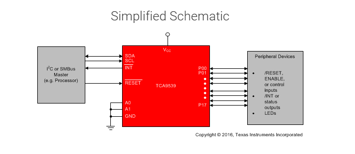

# TCA9539
TCA9539 是一颗通过 I²C/SMBus 控制的 16 位 GPIO 扩展芯片。当 MCU 或 SoC 自带 GPIO 不够时，只需要占用一组 SCL + SDA，就能额外获得 16 个可独立配置为输入或输出的数字引脚。它的供电范围是 1.65～5.5 V，支持 100 kHz 和 400 kHz I²C。
硬件上的逻辑图是这样的：

```text
MCU / SoC
   │
   │ I²C：SCL、SDA
   ▼
TCA9539
   ├── P0.0 ~ P0.7   8 个 GPIO
   └── P1.0 ~ P1.7   8 个 GPIO
```
也就是用两个通信引脚换来 16 个普通 GPIO。



## 主要功能

芯片内部由 I²C 控制器、移位寄存器、两组 8 位 I/O 端口、输入输出寄存器、极性反转寄存器以及中断逻辑组成。MCU 通过 I²C 读写寄存器，芯片再把寄存器内容转换为真实引脚方向和电平。
需要注意，输入寄存器读取的是引脚上的真实电平；而输出寄存器读回的是输出锁存器中的值，不一定等于引脚实际测得的电平。

## 主要寄存器

TCA9539 只有 8 个核心寄存器：

|     地址 | 寄存器                  | 作用              |
| -----: | -------------------- | --------------- |
| `0x00` | Input Port 0         | 读取 P0.0～P0.7 电平 |
| `0x01` | Input Port 1         | 读取 P1.0～P1.7 电平 |
| `0x02` | Output Port 0        | 设置 Port 0 输出值   |
| `0x03` | Output Port 1        | 设置 Port 1 输出值   |
| `0x04` | Polarity Inversion 0 | 反转 Port 0 输入逻辑  |
| `0x05` | Polarity Inversion 1 | 反转 Port 1 输入逻辑  |
| `0x06` | Configuration 0      | 配置 Port 0 输入/输出 |
| `0x07` | Configuration 1      | 配置 Port 1 输入/输出 |

其中配置寄存器中：

```text
bit = 1：对应引脚配置为输入
bit = 0：对应引脚配置为输出
```

芯片上电或复位后，两个配置寄存器默认为 0xFF，所以 16 个 GPIO 默认全部为输入，这样能够避免上电时意外驱动外部器件。

极性反转寄存器：

0x04 和 0x05 是输入极性反转寄存器。例如一个按键低电平表示按下：
```text
实际引脚：
高电平 = 松开
低电平 = 按下
```

将对应极性反转位设置为 1 后，软件读到的结果可以变成：
```text
逻辑 0 = 松开
逻辑 1 = 按下
```

这个功能只改变输入寄存器返回的数据逻辑，不会改变引脚真实电平，也不会改变输出电平。

## 中断功能
芯片有一个低有效的 INT 引脚。当任何一个配置为输入的 GPIO 出现上升沿或下降沿时，TCA9539 可以拉低 INT，通知 MCU 输入状态发生变化，这样 MCU 不必不断通过 I²C 轮询。
工作流程如：
```text
按键状态变化
    ↓
TCA9539 检测到输入变化
    ↓
INT 拉低
    ↓
MCU 进入中断
    ↓
MCU 通过 I²C 读取 Input Port 寄存器
    ↓
确定哪个 GPIO 发生变化
```

INT 是开漏输出，因此外部需要上拉电阻。读取产生中断的对应 Port 输入寄存器后，中断会被清除；读取 Port 0 不会清除由 Port 1 产生的中断，反之亦然。输出引脚的变化不会产生输入中断。
需要注意：TCA9539 没有单独的“中断状态寄存器”，驱动通常需要保存上一次输入值，再与本次读取值比较，确定具体是哪一位发生了变化。

## RESET 功能

RESET 是低有效硬件复位引脚：
```text
RESET = 0：芯片保持复位
RESET = 1：芯片正常工作
```

拉低足够时间后，内部寄存器和 I²C/SMBus 状态机会恢复默认状态；芯片也具备上电复位功能。RESET 没有主动驱动时，需要上拉到 VCC。
复位后的关键状态是：
```text
Configuration = 0xFFFF   所有 GPIO 为输入
Output        = 0xFFFF   输出锁存值为高
Polarity      = 0x0000   不反转输入
```

虽然 Output 寄存器默认是高，但因为引脚默认配置成输入，所以复位后不会立即把 16 个引脚主动拉高。

## I²C 地址
芯片有 A0 和 A1 两个地址配置引脚，可选择四个 7 位 I²C 地址：

| A1 | A0 | 地址     |
| -- | -- | ------ |
| 低  | 低  | `0x74` |
| 低  | 高  | `0x75` |
| 高  | 低  | `0x76` |
| 高  | 高  | `0x77` |

所以一条 I²C 总线上最多可以放置 4 颗 TCA9539，即扩展最多：4 × 16 = 64 个 GPIO 。前提是各器件的 A0、A1 配置不同。

简单点来说，TCA9539 是一颗将 I²C 转换为 16 路可编程数字 GPIO 的扩展器，支持输入、输出、输入极性反转、输入变化中断和硬件复位，适合解决 MCU GPIO 数量不足以及远端低速控制信号集中的问题。由于所有控制都要经过最高 400 kHz 的 I²C 总线，它更适合低速状态和控制信号，不适合代替 MCU 原生 GPIO 完成高速位翻转、精确 PWM、纳秒级时序或实时采样。这是由其 I²C 控制路径和总线速率推导出的使用限制。

相关数据来自德州TI官网的datasheet，https://www.ti.com.cn/document-viewer/cn/TCA9539/datasheet#abstract/SCPS2542274

## 驱动编写
我们了解了TCA9539的工作原理之后便可以开始着手编写驱动了。整理思路如下：

TCA9539 扩展的 GPIO 多用于车门状态、开关输入、指示灯控制和普通状态检测等低速场景，这些信号对响应时间的要求通常不高，因此没有必要为每颗芯片额外占用 SoC 的 GPIO 中断资源。可以复用系统中周期为 100 ms 的 hw_monitor 任务，由它定期检查各个 TCA9539 的 INT 引脚。当发现某颗芯片的 INT 被拉低时，hw_monitor 不直接访问 I²C，而是将该芯片的 device_index 写入 RTOS 队列；阻塞在队列上的 tca9539_read_main_thread 被唤醒后，再根据设备编号读取对应芯片的两个输入端口，并刷新该设备的 GPIO 软件缓存。

这种设计将“检测设备状态变化”和“执行 I²C 数据刷新”两个过程解耦：hw_monitor 只负责检查和通知，TCA9539 线程统一负责 I²C 操作，而应用层的大多数读取请求可以直接访问缓存，无需每次都占用 I²C 总线。这样既能提高 GPIO 读取速度，又能减少共享总线上的无效访问，并利用 RTOS 队列实现任务之间安全、清晰的通知与唤醒。队列中只保存需要刷新的设备编号，实际的 16 路 GPIO 状态仍保存在每颗设备的软件缓存中。

首先，为每颗 TCA9539 保存两个端口的软件缓存。两个 uint8_t 正好对应芯片的 16 路 GPIO，每个 bit 表示一个引脚：

```c
#define TCA9539_PORT_NUM  2U

typedef struct { 
    /* 当前 GPIO 电平缓存 */ 
    uint8_t g_pin_value[TCA9539_PORT_NUM]; 
    /* 上一次 GPIO 电平，用于检测变化 */ 
    uint8_t g_pin_value_ori[TCA9539_PORT_NUM]; 
    /* GPIO 方向：1 为输入，0 为输出 */ 
    uint8_t g_pin_direction[TCA9539_PORT_NUM]; 
} tca9539_runtime_t;
```

RTOS 队列中不保存 GPIO 电平，而只保存一个 uint16_t device_index，用于通知读取线程“哪一颗 TCA9539 需要刷新”：

```c
#define TCA9539_INTERRUPT_QUEUE_LENGTH 16U 

OS_QUEUE_DECLARE_BUFFER( 
    g_tca9539_interrupt_queue_buffer, 
    TCA9539_INTERRUPT_QUEUE_LENGTH, 
    sizeof(uint16_t) 
); 

os_queue_t g_tca9539_interrupt_queue;
```

读取线程平时阻塞在队列上，不占用 CPU。队列中出现设备编号后，线程被唤醒，通过 I²C 读取对应芯片的两个输入端口：

```c
void tca9539_read_main_thread(void) 
{ 
    uint16_t device_index; 
    while (1) { 
        os_queue_receive( g_tca9539_interrupt_queue, &device_index, OS_MAX_DELAY); 
        tca9539_update_port_value(device_index); 
        /* 
         * 读取后 INT 正常应恢复为高。 
         * 如果仍然为低，则重新入队，进行有限次数重试。 
         */ 
        if (tca9539_int_pin_is_low(device_index)) { 
            tca9539_retry_enqueue(device_index); 
        } 
    } 
}
```


tca9539_update_port_value() 是缓存刷新的核心。它先通过 I²C 一次读取两个 Input Port，再保存旧值、覆盖新值，并找出发生变化的输入引脚：

```c
Std_ReturnType tca9539_update_port_value( uint16_t device_index) 
{ 
    uint8_t new_value[2]; 
    uint8_t changed[2]; 

    if (tca9539_i2c_read( device_index, TCA9539_INPUT_PORT0_REG, new_value, sizeof(new_value)) != E_OK) 
    { 
        return E_NOT_OK; 
    } 
    lock_cache(device_index); 

    for (uint8_t port = 0U; port < 2U; port++) { 
        g_device[device_index].g_pin_value_ori[port] = g_device[device_index].g_pin_value[port]; 
        g_device[device_index].g_pin_value[port] = new_value[port]; 
        changed[port] = (g_device[device_index].g_pin_value_ori[port] ^ g_device[device_index].g_pin_value[port]) & g_device[device_index].g_pin_direction[port]; 
    } 

    unlock_cache(device_index); 
    
    /* 伪代码：根据业务需要通知状态变化 */ 
    
    if ((changed[0] != 0U) || (changed[1] != 0U)) 
    { 
        notify_gpio_changed(device_index, changed); 
    } 
    return E_OK; 
}
```

应用调用 tca9539_read() 时，大多数情况下只需要从缓存中取出对应 bit，不再产生 I²C 事务：

```c
Std_ReturnType tca9539_read( uint16_t device_index, uint8_t channel, uint8_t *value) 
{ 
    uint8_t port = channel / 8U; 
    uint8_t bit = channel % 8U; 
    /* 
     * 伪代码： 
     * 如果缓存无效、过期，或者 INT 仍为低， 
     * 可以先执行一次按需刷新。 
     */ 
    if (cache_need_refresh(device_index)) 
    { 
        if (tca9539_update_port_value(device_index) != E_OK) 
        { 
            return E_NOT_OK; 
        } 
    } 
    
    lock_cache(device_index); 
    
    *value = (g_device[device_index].g_pin_value[port] >> bit) & 0x01U; 
    
    unlock_cache(device_index); 
    
    return E_OK; 
}

整个流程可以概括为：

```text
hw_monitor 检查 INT
        ↓
将 device_index 写入队列
        ↓
读取线程被唤醒
        ↓
I²C 读取两个输入端口
        ↓
刷新 g_pin_value 和 g_pin_value_ori
        ↓
应用直接读取软件缓存
```

队列只负责传递“哪颗设备需要刷新”，而 GPIO 数据始终保存在设备的软件缓存中。这样既利用了 RTOS 队列的阻塞唤醒和并发保护能力，又避免应用每次读取 GPIO 时都访问共享 I²C 总线。


